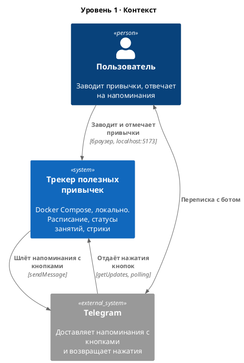
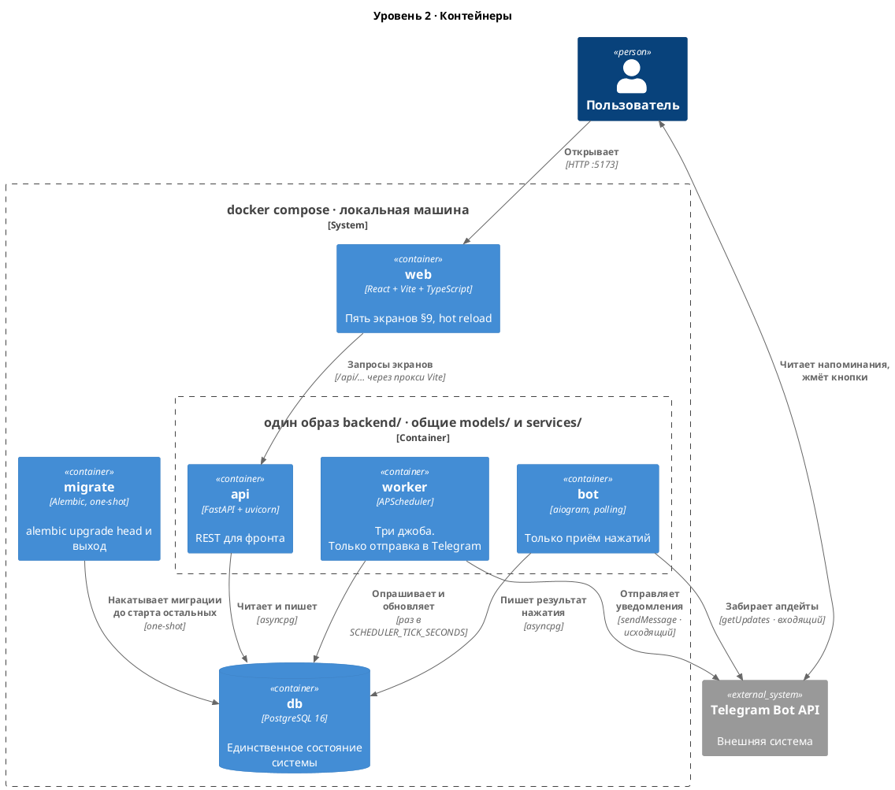
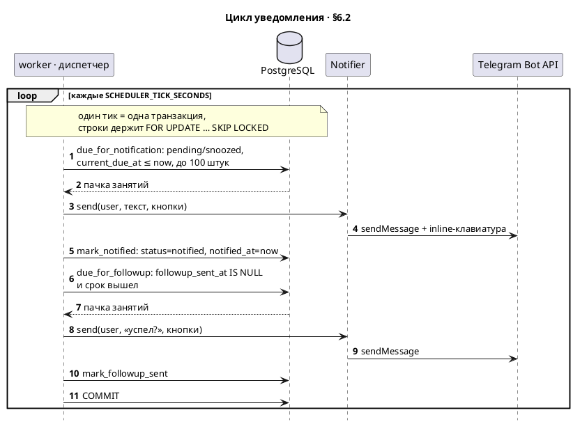
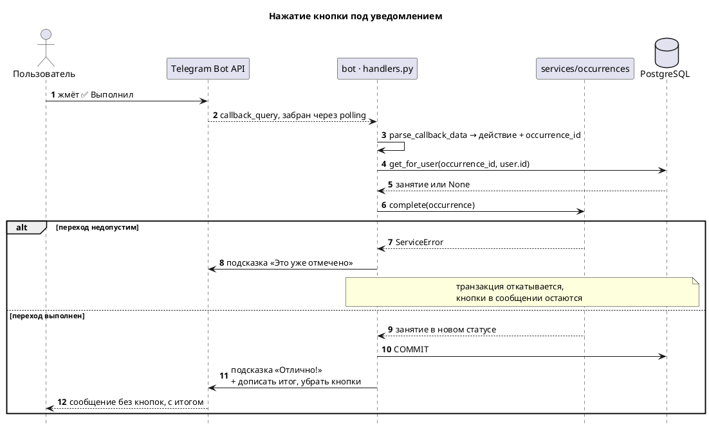
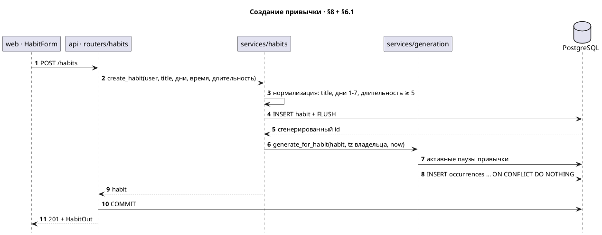
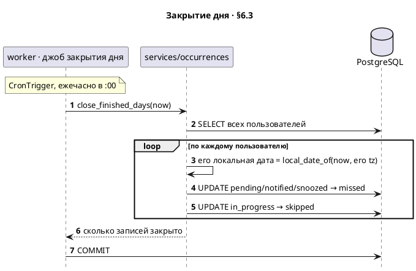

# Архитектура

Источник — код в `backend/app/` и `docker-compose.yml`. При расхождении с этим файлом верить коду.

Здесь только то, что не видно из чтения одного файла: как процессы разложены по контейнерам и в каком порядке они разговаривают. Что за проект и как его поднять — в [`README.md`](../README.md). Таблицы и поля — в [`erd.md`](erd.md). Правила предметной области — в [`requirements.md`](requirements.md).

## Про формат

Диаграммы — PlantUML. C4 нарисован библиотекой [C4-PlantUML](https://github.com/plantuml-stdlib/C4-PlantUML) из стандартной поставки, поэтому уровни задаются макросами `Person` / `System` / `Container`, а не прямоугольниками, стилизованными руками. `!include <C4/…>` берётся из stdlib, встроенной в PlantUML начиная с 1.2021.x, — интернет при рендере не нужен.

**GitHub PlantUML в markdown не рендерит** (в отличие от Mermaid, на котором сделана [`erd.md`](erd.md)) — блоки ниже видны как исходник. Смотреть картинками:

- расширение **PlantUML** для VS Code — `Alt+D` на блоке, живой предпросмотр;
- IntelliJ — встроенный предпросмотр в `.md`;
- одной командой, без установки Java:

  ```bash
  docker run --rm -v "$PWD:/data" plantuml/plantuml -tsvg /data/docs/architecture.md
  ```

  PlantUML вытаскивает `@startuml`-блоки из любого текстового файла и раскладывает их по именам диаграмм — отсюда `@startuml context`, `@startuml containers` и так далее.

---

## Уровень 1. Контекст

Кто пользуется системой и с чем она разговаривает наружу.



Внешняя система ровно одна. Telegram здесь не «канал уведомлений вообще», а конкретный транспорт: он выбран потому, что даёт кнопки прямо в уведомлении, чего web push в Safari/iOS не умеет. Абстракция под будущую замену есть (`Notifier`), но второй реализации в MVP нет.

Обратите внимание на две встречные связи между системой и Telegram — это не одно двустороннее соединение, а два разных процесса. См. «Бот и воркер» ниже.

---

## Уровень 2. Контейнеры

Шесть сервисов `docker compose`. Три из них — один и тот же образ с разными командами запуска.



Что читается с диаграммы и стоит проговорить словами:

- **Состояние живёт только в `db`.** Ни один процесс не держит его в памяти и не ходит за ним к соседу. Поэтому «выполнил» из веба и «выполнил» из чата — одно и то же изменение одной строки, а не две синхронизируемые копии.
- **Между `api`, `worker` и `bot` нет ни одной связи.** Они не вызывают друг друга — ни по HTTP, ни через очередь. Общее у них — код (`models/`, `services/`) и база.
- **`migrate` не постоянный, а разовый:** `depends_on: condition: service_completed_successfully` у остальных трёх. Отдельным сервисом он вынесен ради Alembic — три процесса, гоняющие миграции в своём entrypoint, дерутся за блокировку. Собирается он из того же `backend/`, но внутрь рамки не помещён намеренно: `services/` и `models/` он не использует вовсе, ему нужен только `alembic/`.
- **Компонентный уровень C4 здесь не нарисован намеренно.** Внутри бэкенд-образа один архитектурно значимый факт — «`api`, `worker` и `bot` тонкие, все решения в `services/`» — и он выражается этой фразой полнее, чем схемой из десяти прямоугольников по числу модулей. Появится второй внешний интерфейс или второй `Notifier` — уровень станет осмысленным.

---

## Три решения, которых на диаграммах не видно

Дальше — то, что забывается первым, потому что из кода это читается только в комментариях.

### Планировщик отдельным процессом, а не внутри `api`

Соблазн очевидный: APScheduler прекрасно поднимается в lifespan FastAPI, и одним контейнером меньше.

Ломается это в тот день, когда `api` запускают в две реплики. Каждая поднимет свой планировщик, оба увидят один и тот же `pending` с наступившим сроком — и человек получит два одинаковых уведомления. Причём заметно это станет не в момент правки кода, а в момент масштабирования, когда связи между причиной и следствием уже никто не помнит.

Отсюда же инвариант 6: воркер **опрашивает БД**, а не держит таймеры в памяти. Таймер, поставленный на 19:00, не переживает `docker compose restart`, а строка в таблице переживает. Плата — задержка до одного тика (`SCHEDULER_TICK_SECONDS`, на отладке 5 секунд, по умолчанию 60).

Страховка на случай, если воркер всё-таки запустят в двух экземплярах, в коде уже стоит: выборки диспетчера идут с `FOR UPDATE … SKIP LOCKED` ([occurrences.py:233](../backend/app/services/occurrences.py#L233)), второй экземпляр просто не увидит строки, которые разбирает первый.

### Бот и воркер — два процесса, оба говорят с Telegram, но в разные стороны

Это самое неочевидное место в схеме, потому что «работа с Telegram» интуитивно кажется одной ответственностью.

| | `worker` | `bot` |
|---|---|---|
| Направление | исходящее | входящее |
| Метод | `Bot.send_message()` | `Dispatcher.start_polling()` |
| Что инициирует | наступивший срок в БД | нажатие пользователя |
| Нужен ли polling | **нет** | да |

Ключ — в последней строке: `Bot.send_message()` работает сам по себе, слушатель апдейтов ему не нужен. Поэтому воркер создаёт свой экземпляр `Bot` ([telegram.py:30](../backend/app/telegram.py#L30)) и никогда не читает апдейты, а бот читает апдейты и почти ничего не отправляет по своей инициативе.

Обратное — держать polling в воркере или слать уведомления из бота — сразу даёт две проблемы. Долгий джоб блокирует обработку нажатий, а два процесса с polling на одном токене отбирают апдейты друг у друга: Telegram отдаёт каждый апдейт ровно один раз, и половина нажатий уходит в процесс, который с ними ничего не делает.

Из этого же следует, почему шаг 6 (гашение кнопок в старых сообщениях) делается **джобом в воркере**, а не вызовом из роутера API: иначе с Telegram начнут разговаривать три процесса вместо двух.

### Диспетчер сначала отправляет и только потом ставит `notified_at`

Порядок именно такой, и он выглядит неправильным ([jobs.py:80-85](../backend/app/scheduler/jobs.py#L80-L85)).

Оба порядка теряют согласованность при падении между двумя шагами, вопрос только в том, какая потеря дешевле:

| Порядок | Что будет при сбое |
|---|---|
| отметить → отправить | человек не получил уведомление, а занятие уже `notified`. Повтора не будет никогда, к ночи джоб закроет его как `missed` |
| **отправить → отметить** | человек получил уведомление, отметка не проставилась. На следующем тике придёт второе такое же |

Второе неприятно, первое — молча ломает продукт. Выбрано второе.

Отдельно: отметка не проставляется и при обычной ошибке отправки — `_deliver` возвращает `False`, и occurrence остаётся в прежнем статусе до следующего тика ([jobs.py:36-49](../backend/app/scheduler/jobs.py#L36-L49)). Одна недоставленная запись не роняет остальную пачку.

Побочное следствие этого порядка, которое однажды уже стоило бага: на момент сборки текста первого уведомления запись ещё `pending`, а не `notified`. Поэтому `messages.reminder()` не спрашивает `can_snooze()` — та требует статуса `notified`, и кнопка «+5 мин» не показывалась бы никогда.

---

## Сиквенсы

Нарисованы четыре сценария, где участников больше одного и порядок неочевиден. CRUD-ручки, снуз, статистика и heatmap диаграммами не проясняются — что не нарисовано и почему, перечислено в конце.

### 1. Цикл уведомления

Один тик диспетчера, обе его половины: первое уведомление и догоняющий пинг. Всё внутри одной транзакции.



Что не поместилось на диаграмму:

- **Отправка (шаг 3) идёт раньше отметки (шаг 5) намеренно.** Обоснование — в «Диспетчер сначала отправляет» выше. Если `sendMessage` на шаге 4 упал, `mark_notified` не выполняется и запись достаётся следующему тику.
- **`Notifier` показан отдельным участником ради инварианта 5.** Это не сетевая граница, а протокол (`app/notifier.py`): воркер не знает, что на том конце aiogram. При пустом `TELEGRAM_BOT_TOKEN` на его месте оказывается `LogNotifier`, и всё остальное на диаграмме работает без изменений — выборки, переходы и защита от повторов настоящие, наружу уходит строка в лог.
- **Срок догоняющего пинга считается двумя способами** (§5): нажавшему «Начал» — от `started_at + duration`, не отреагировавшему — от `GREATEST(current_due_at, notified_at) + duration`. `GREATEST` разводит два сообщения на длительность занятия, когда воркер простоял и оба условия §6.2 стали истинными в одном тике.
- **Что происходит после доставки — в следующей диаграмме.** Полный круг «воркер → Telegram → человек → бот → БД» рисовать одним сиквенсом можно, но между отправкой и нажатием проходит от секунды до часов, и это два независимых события, а не продолжение одного. Склеенная диаграмма врала бы про связность.

### 2. Нажатие кнопки в чате



Что не поместилось:

- **Шаг 4 — это `get_for_user`, а не `session.get`.** `callback_data` приходит снаружи и подделывается тривиально, поэтому владелец проверяется запросом, а не после загрузки.
- **Шаг 6 — единственное место, где решается статус.** Хендлер знает только словарь «кнопка → функция» (`ACTIONS`); ни одного `if` про статусы в `app/bot/` нет. Ровно та же функция вызывается из `api/routers/occurrences.py` — это и есть инвариант 4 в действии.
- **Левая ветка `alt` — не ошибка, а норма.** Кнопка под сообщением в Telegram остаётся кликабельной вечно, поэтому двойное нажатие и нажатие на уже закрытое занятие случаются постоянно. `AlreadyInStatus`, `InvalidTransition` и `SnoozeLimitReached` превращаются в реплику через `explain()`, а не в трейсбек.
- **Кнопки убираются сразу, а не по доменной ошибке на следующем нажатии.** Сообщение в чате должно показывать текущее положение дел: без дописанного итога через день не понять, отвечал ты на это уведомление или нет.
- **Сообщение старше 48 часов Telegram не даёт редактировать.** Такое приходит как `InaccessibleMessage`, и правка на шаге 11 тихо пропускается — но переход статуса уже записан на шаге 10, отказываться от него было бы хуже.
- **Известное расхождение:** если то же действие сделать в вебе, это сообщение в чате останется с живыми кнопками. `message_id` нигде не хранится, дотянуться до сообщения некому. Находка 2 в `HANDOFF.md`, чинится шагом 6.

### 3. Создание привычки с немедленной генерацией



Что не поместилось:

- **Шаг 6 — то, ради чего эта диаграмма нарисована.** Спека §6.1 описывает генератор как ночной джоб, и по букве привычка, заведённая в понедельник днём, начала бы напоминать во вторник. Поэтому создание и правка привычки зовут генератор сами, синхронно. Ночной джоб при этом никуда не делся — он идемпотентен и просто не найдёт, что создавать.
- **Шаг 4 — `flush`, а не `commit`.** Нужен сгенерированный `habit.id` для occurrences, но границу транзакции определяет адаптер (шаг 10), а не сервис. Одно действие пользователя — одна транзакция: привычка без занятий или занятия без привычки не должны существовать даже мгновение.
- **Шаг 8 — `ON CONFLICT DO NOTHING`, а не «проверить и вставить».** Идемпотентность (инвариант 7) держится на уникальном индексе `(habit_id, scheduled_at)`. Проверка чтением здесь не годится: между `SELECT` и `INSERT` влезет ночной джоб и создаст дубль.
- **Занятия в прошлом не создаются.** Если привычка заведена в 21:00 на 19:00, сегодняшнего занятия не появится — иначе диспетчер прислал бы уведомление в ту же секунду. Горизонт генерации — двое суток вперёд.
- **Правка привычки (`PATCH`) идёт тем же путём**, но через `regenerate`: сначала удаляются будущие `pending`, потом создаются новые. Между ними обязателен `flush`, иначе `INSERT` уйдёт в БД раньше `DELETE` и словит конфликт по тому же индексу. Прошлые и текущие занятия не трогаются (§8) — история должна остаться достоверной.

### 4. Закрытие дня



Что не поместилось:

- **Джоб не спрашивает «а наступила ли у него полночь?».** Он берёт текущую локальную дату пользователя и закрывает всё, что раньше неё. Результат тот же, но не надо помнить, когда джоб отработал в прошлый раз: повторный запуск в том же часу найдёт ноль записей (инвариант 7), а суточный простой контейнера закроет все пропущенные дни, а не только последний.
- **Ежечасно — потому что полночь наступает в разное время в разных таймзонах.** Один пользователь — не повод усложнять, но правило одно для всех.
- **Два `UPDATE`, а не один с `CASE` в `WHERE`.** Правило «во что закрывать» живёт списком `DAY_CLOSE_TRANSITIONS` в сервисе, чтобы его было видно глазами (инвариант 4 распространяется и на массовые операции). Разводить статусы условием внутри SQL было соблазнительно и неправильно.
- **`in_progress` уходит в `skipped`, а не в `missed`.** У записи заполнен `started_at` — человек отреагировал, просто не закрыл занятие. `missed` по §11 означает «не отреагировал вовсе» и потому неизменяем. Для серии разницы нет, оба ломают её одинаково (§7), разница в честности статуса.
- **Записи с `current_due_at` в будущем джоб пропускает.** Снуз незадолго до полуночи переносит срок в новые сутки, а `local_date` остаётся вчерашним — без этой оговорки закрытие дня убивало бы занятие раньше срока, обещанного кнопкой.
- **`paused` не трогается ни одним из двух запросов.** Приостановленный день в расчётах не участвует и пингов не порождает.

---

## Что намеренно не нарисовано

Решения об исключении — половина работы над этим файлом, поэтому они записаны, а не подразумеваются.

| Сценарий | Почему без диаграммы |
|---|---|
| Компонентный уровень C4 | Десять модулей `services/` — перерисовка дерева файлов. Единственный значимый факт («адаптеры тонкие») сказан фразой |
| CRUD привычек, список на «Сегодня», профиль | Один участник, линейный порядок: разобрал вход → позвал сервис → закоммитил → отдал ответ. Диаграмма повторила бы сигнатуру функции |
| Снуз, «Начал», «Пропустить» | Тот же путь, что и «Выполнил» в сиквенсе 2, меняется одна функция в `ACTIONS`. Четыре одинаковые диаграммы — четыре места, где расходиться с кодом |
| Статистика, стрики, heatmap | Один запрос и чистая функция поверх результата. Сложность там арифметическая (правило 14 дней, `streak_reset_on`), а её сиквенс не показывает — она в §7 |
| Смена таймзоны и предпросмотр | Участник один — `api` с сервисом. Интересное в ней — какие статусы пересчитываются и что удаляется, это таблица, а не порядок вызовов (§8) |
| Пауза и снятие паузы | То же: одно действие пользователя, вся сложность в правилах, а не в последовательности |
| Настоящий Telegram Login Widget | В MVP не работает — `localhost` он не принимает (§12.4). Рисовать поток, которого нет в коде, значит документировать намерение как факт |
| Порядок старта контейнеров | Выражается `depends_on` в `docker-compose.yml` точнее, чем схемой, и там же исполняется |
