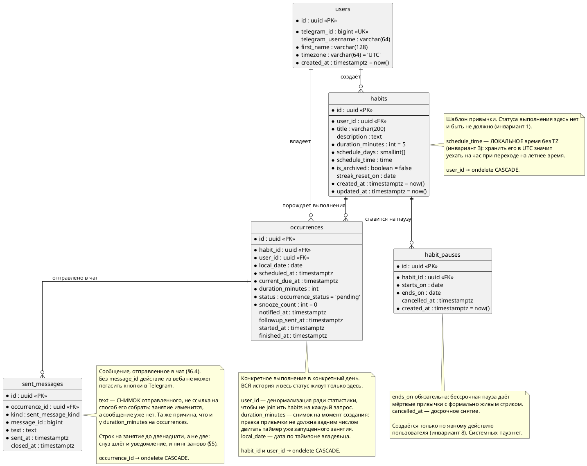

# ER-диаграмма

Источник — `backend/app/models/`. При любом расхождении с кодом верить коду, не этому файлу.

Ключевой инвариант виден прямо в диаграмме: у `habits` нет ни одного поля статуса
или времени выполнения — только шаблон расписания и метаданные. Весь статус
(`status`) и все временные метки выполнения (`notified_at`, `followup_sent_at`,
`started_at`, `finished_at`) лежат на `occurrences`.

Диаграмма — PlantUML, как и в [`architecture.md`](architecture.md). GitHub её в markdown
не рендерит; чем смотреть картинкой — в разделе «Про формат» там же.

Как читать: **точка перед полем означает `NOT NULL`**, поле без точки — nullable.
Через `=` показано значение по умолчанию, `«PK»` / `«FK»` / `«UK»` — ключи.
Связи в нотации «воронья лапка»: `||—o{` читается как «один ко многим, ноль допустим».

## Ограничения уровня таблицы

Не видны в списках полей выше, но существуют в БД.

**Уникальность и внешние ключи**

- `occurrences`: `UNIQUE(habit_id, scheduled_at)` — защита от дублей при повторном запуске генератора (инвариант 7). На нём же держится `ON CONFLICT DO NOTHING` в `services/generation.py`.
- `users`: `UNIQUE(telegram_id)` — он же `chat_id` личной переписки с ботом.
- Все FK — с `ondelete CASCADE`. Поэтому `python -m app.fixtures.seed`, пересоздавая пользователя, уносит вместе с ним все привычки и историю.

**Проверки (`CHECK`)**

| Таблица | Ограничение | Зачем |
|---|---|---|
| `habits` | `duration_minutes >= 5` | §3: убирает класс «привычек без длительности» |
| `habits` | `array_length(schedule_days, 1) BETWEEN 1 AND 7` | привычка без единого дня расписания не имеет смысла |
| `habits` | `schedule_days <@ ARRAY[1,…,7]` | дни недели 1–7, пн–вс |
| `occurrences` | `snooze_count BETWEEN 0 AND 5` | §4: максимум пять снузов |
| `occurrences` | `duration_minutes >= 5` | то же правило, что и на шаблоне — снимок не должен его нарушать |
| `habit_pauses` | `ends_on >= starts_on` | отрицательных интервалов не бывает |

**Индексы**

| Таблица | Индекс | Подо что |
|---|---|---|
| `occurrences` | `(status, current_due_at)` | запрос диспетчера уведомлений, §6.2 — раз в тик |
| `occurrences` | `(user_id, local_date)` | календарь-heatmap и расчёт стриков, §7 |
| `habits` | `user_id`, `is_archived` | список привычек пользователя, §9 |
| `habit_pauses` | `habit_id` | загрузка окон паузы генератором, §6.1 |
| `sent_messages` | `occurrence_id` | сообщения одного занятия — их гасит диспетчер при вытеснении |
| `sent_messages` | `(occurrence_id) WHERE closed_at IS NULL` | джоб закрытия сообщений, §6.4 — раз в тик. Частичный: незакрытых всегда единицы, а закрытых со временем накапливается по одной на занятие |

**Типы-перечисления**

`occurrence_status` — enum на стороне Postgres: `pending`, `notified`, `snoozed`, `in_progress`, `done`, `skipped`, `missed`, `paused`. Имена из §4, менять их нельзя. Переходы между ними — в [`architecture.md`](architecture.md) и §4 спеки.

`sent_message_kind` — `notification` (первое уведомление) и `followup` (догоняющий пинг). Оба вида описаны в §5.
