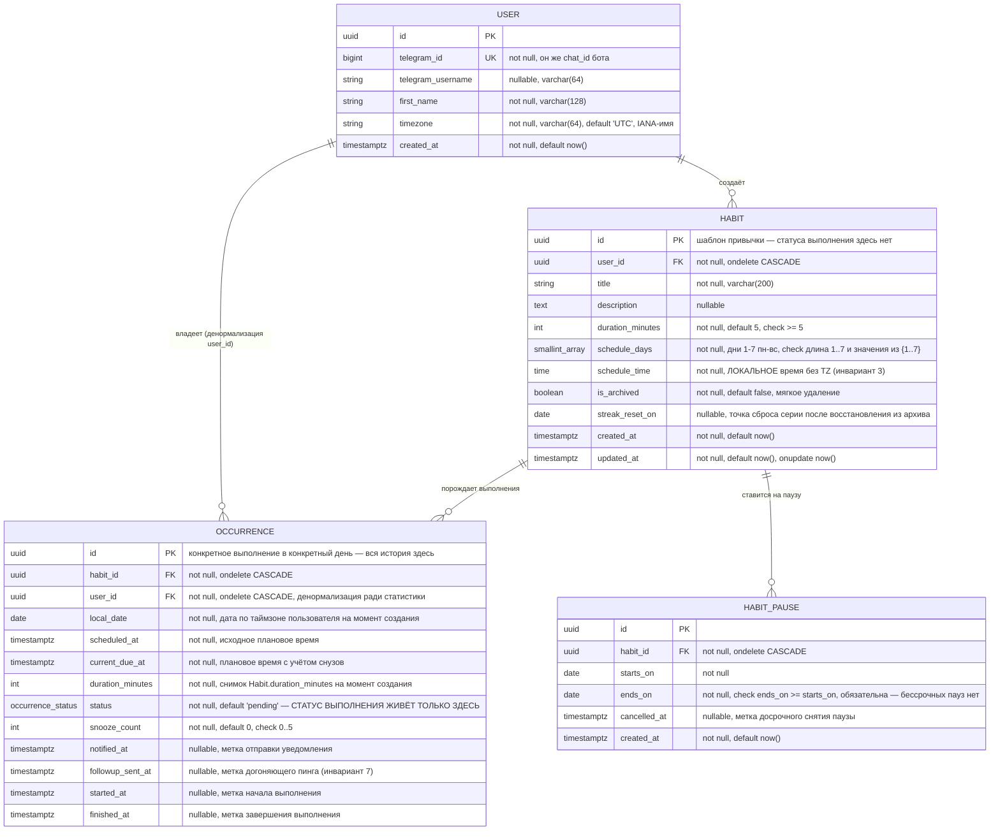

# ER-диаграмма

Источник — `backend/app/models/`. При любом расхождении с кодом верить коду, не этому файлу.

Ключевой инвариант виден прямо в диаграмме: у `HABIT` нет ни одного поля статуса
или времени выполнения — только шаблон расписания и метаданные. Весь статус
(`status`) и все временные метки выполнения (`notified_at`, `followup_sent_at`,
`started_at`, `finished_at`) лежат на `OCCURRENCE`.

## Ограничения уровня таблицы (не видны в полях выше)

- `occurrences`: `UNIQUE(habit_id, scheduled_at)` — защита от дублей при повторном запуске генератора (инвариант 7).
- `occurrences`: индекс `(status, current_due_at)` — под диспетчер уведомлений, опрос раз в минуту.
- `occurrences`: индекс `(user_id, local_date)` — под календарь-heatmap и расчёт стриков.
- `habits`: индекс на `user_id` и на `is_archived`.
- `habit_pauses`: индекс на `habit_id`.
